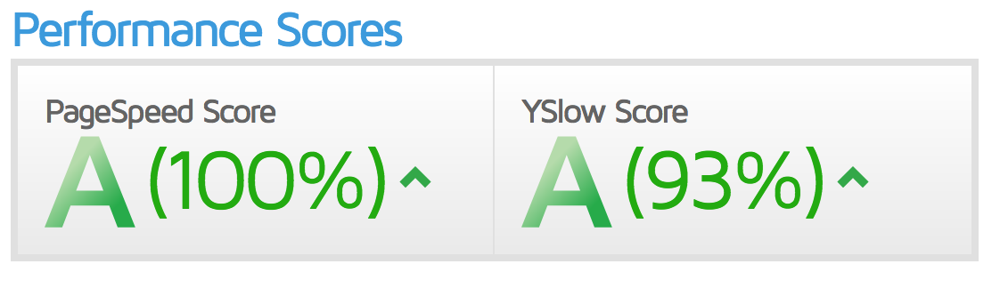
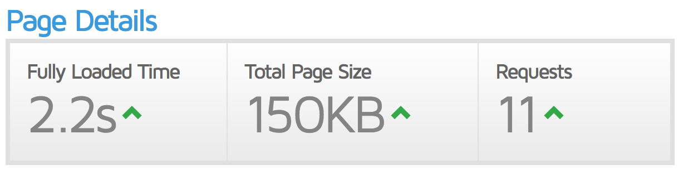

Sciblog: A blog with the appearance of a scientific paper.
==================

Blog developed in django with the same appearance of a research paper written in [Latex](https://en.wikipedia.org/wiki/LaTeX).

* CSS and Latex fonts integrated
* Posts are presented in two columns like a paper
* Formulas can be added with Latex notation 
* Share in social networks
* RSS feed
* Post search 
* Blog optimized for SEO
* Comments with disqus
* Easy writing with Ckeditor
* Responsive for mobile
* (Optional) Web optimization with CloudFlare
* (Optional) Installation of free SSL certificate

Example of sciblog: http://miguelgfierro.com

Installation
==================

We need to install several libraries. In Linux the commands are:

	$ apt-get install -y python-dev libpq-dev python-pip git apache2 libapache2-mod-wsgi
	$ pip install -r requirements.txt 

NOTE: django version must be 1.7. 

Set up the project in localhost
==================================================
The first step is to generate the database. In the projects folder:
  
	$ python manage.py syncdb  
	
Django will ask you to create a superuser. You have to put the username and password. The email is optional. 
This will generate a file called `db.sqlite3` which is the database where all the blog content is stored.

After that you have to make what is called a migration, to create the tables in your database. To do that:
	
	$ python manage.py makemigrations
	$ python manage.py migrate

In another terminal you have to run django development server:

	$ python manage.py runserver  
	
In a browser put the link: [http://localhost:8000/admin/](http://localhost:8000/admin/)

The panel will ask you to add username and password. Once you are in django dashboard you can start to add content to
your blog.

When you are in localhost you have to set `DEBUG = True` in `sciblog/settings.py`. You can set it to False but you won't see the images the user uploaded through the admin dashboard. In production this is handled by apache.

To work with disqus comments you have to get your `DISQUS_API_KEY` and `DISQUS_WEBSITE_SHORTNAME`. They can be obtained https://disqus.com/api/applications/ 

Set up the project in a Ubuntu VPS server
==================================================

First make sure that you have installed git, apache2 and libapache2-mod-wsgi as explained before. Also, change the key in `private.py`.

	$ cd /var/www
	$ git clone https://github.com/hoaphumanoid/sciblog.git
	$ cd sciblog
	$ cp sciblog/private.template.py sciblog/private.py
	$ python manage.py syncdb
	$ python manage.py makemigrations
	$ python manage.py migrate

Set the correct permissions:

	$ chown www-data:www-data /var/www/sciblog
	$ chown www-data:www-data /var/www/sciblog/db.sqlite3
	$ chown www-data:www-data /var/www/sciblog/img	

Configure apache (in sciblog.conf change example.com for your url):

	$ cp sciblog.conf /etc/apache2/sites-available/
	$ a2ensite sciblog.conf
	$ a2enmod rewrite
	$ a2enmod expires
	$ service apache2 restart
	
Add your first content to the blog
==================================================

Press add in Post to add your first post. You can add different sections, images and formulas. If you use a formula please select the flag `Post with Latex formula`. This will load the js necessary to render the Latex code. If the flag is not activated then the js is not added to the template (we don't want extra page load if we are not using formulas, right?).

You will see that your blog is working properly going to the url: [http://localhost:8000](http://localhost:8000) (in production you'll have to add something like http://miguelgfierro.com)

Create the about page
==================================================

Go to the admin console and add your first flat page. A flat page is a static html code. 

In Flat pages press add. In url put `/about/` (don't forget / in both sides). In title put your name, in sites put your site and in content put whatever you want. 

Notes to manage the blog in the production environment
==================================================

When you are in production you have to set `DEBUG = False` in `sciblog/settings.py`.

Also the first time you enter in your admin console (http://miguelgfierro.com/admin/) you have to go to sites and EDIT the default site, which is example.com. Change it for the name of your site without `http://` (my case would be miguelgfierro.com).
This will set the first entry in the database to your site, which is related to the variable SITE_ID = 1 in `sciblog/settings.py`. You can see the number of the site in http://miguelgfierro.com/admin/sites/site/1/. If you add another site, then it will have a different number in the database, so for everything to work you have to change the variable SITE_ID. In my experience it is better if you don't touch anything :-)

Managing mobile view
==================================================
In order to debug with a mobile phone first you need to set `DEBUG = True` in `sciblog/settings.py`. Then you have to run the django server in the computer's external IP. To do that:

	$ python manage.py runserver 0.0.0.0:8000
	 
Then you need to know the IP of your computer. In Linux and Mac the command is `ifconfig`, in Windows is `ipconfig`. Then, to access your computer's server from a mobile phone, you have to open a browser in the phone and put the IP you just get. Let's assume the IP in my computer is 192.168.1.5, then you put in your mobile browser:
	 
	http://192.168.1.5:8000 

Speed up page with Cloudflare (optional)
==================================================

You can use [Cloudflare](https://www.cloudflare.com/) to speed up your page and protect it. You just need to change the DNS. This is how my web looks like in terms of speed using [gtmetrix](https://gtmetrix.com):

 
Secure page with SSL certificate (optional)
==================================================

You can install a free SSL certificate with [Let's Encript](https://letsencrypt.org/). Google prioritizes pages with SSL security, so https has became a key element for SEO. The first step is to set to True the flag `HTTPS` in settings.py. 

The basic installation in an apache server is very straightforward, as it is explained [here](https://letsencrypt.org/howitworks/). In the file sciblog.conf you have the configuration to activate the SSL. Furthermore, it allows to redirect http://example.com, https://example.com, http://www.example.com to https://example.com. 

	$ git clone https://github.com/letsencrypt/letsencrypt
	$ cd letsencrypt
	$ ./letsencrypt-auto --help
	$ ./letsencrypt-auto --apache
    $ a2enmod ssl
    $ service apache2 restart
    
When the certificate expires, you just need to renew it. This task can be automated as Let's Encript explains in their [web](https://letsencrypt.org/getting-started/) or you can use a CRON task. To renew the certificate:
    
    $ ./letsencrypt-auto renew
    $ service apache2 restart

NOTE: if you decide to set the SSL certificate along with Cloudflare, it is better to pause Cloudflare while installing the SSL certificate to check that it is working correctly in your server. Later, you can resume CloudFlare and go to Crypto and set SSL to full strict.
 
